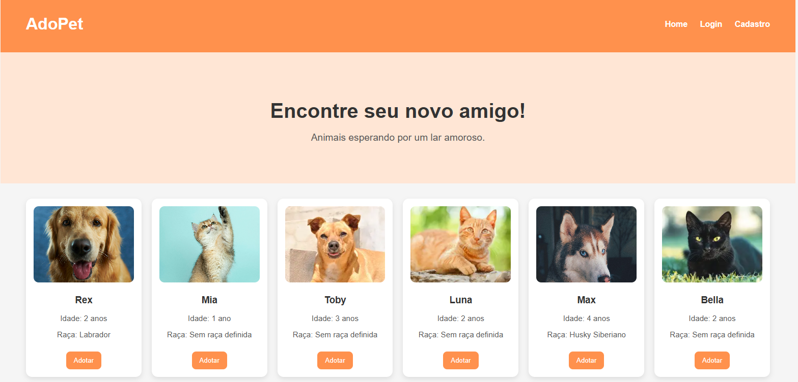

# 🐾 Adoção de Animais - Frontend

Bem-vindo ao meu projeto de **Adoção de Animais**! 🌟  
Este é um site feito com **HTML, CSS e JavaScript**, desenvolvido para prática e aprendizado de **Front-end**. Aqui você pode visualizar perfis de animais disponíveis para adoção de forma organizada e amigável.

---

## 📚 Sobre o Projeto

- Projeto criado com objetivo de **aprimorar minhas habilidades em Front-end**, incluindo layout, responsividade e design intuitivo.
- Todo o **CSS, HTML e lógica de navegação** foram criados por mim.
- Focado em **experiência do usuário**, com cards de animais bem estruturados e navegação simples.
- Projeto feito apenas para **aprendizado**, não está conectado a backend real.

---

## 🖌️ Visual do Projeto

  
*Exemplo de como os cards dos animais aparecem na página.*

---

## 🚀 Funcionalidades

- Layout responsivo para **desktop e mobile**.
- Cards de animais com **informações básicas**.
- Design moderno e limpo, com **cores amigáveis e destaque visual**.
- Fácil de adaptar ou conectar a um backend real no futuro.

---

## 🛠️ Tecnologias

- HTML5
- CSS3
- JavaScript
- Font Awesome (para ícones)

---

## 📂 Estrutura do Projeto
adocao-animais-frontend/
│
├── index.html # Página principal
├── style.css # Estilos do site
├── script.js # Interações e animações
├── assets/ # Imagens e ícones
└── README.md # Este arquivo

---

## 📝 Observações

Projeto desenvolvido para aprendizado e prática pessoal.

Todo o front-end foi feito por mim, e pode ser facilmente adaptado ou integrado com backend posteriormente.

---

## 🔗 Contato

LinkedIn: laiscorreax

GitHub: laiscorreax

E-mail: laiscorreax@gmail.com

---

## 💻 Como Visualizar
Clone o repositório:
Abra o terminal ou prompt de comando e digite:
git clone https://github.com/laiscorreax/adocao-animais-frontend.git

Entre na pasta do projeto:
cd adocao-animais-frontend

Abra no navegador:
Localize o arquivo index.html dentro da pasta do projeto e abra-o em qualquer navegador moderno (Chrome, Edge, Firefox, etc.).

Pronto!
Agora você pode explorar o layout, ver os estilos em CSS, interações em JavaScript e tudo que foi desenvolvido no front-end.

💡 Dica: Se quiser testar alterações no CSS ou HTML, salve os arquivos e atualize a página no navegador para ver as mudanças imediatamente.

---

## ✨ Agradecimentos.

Muito obrigada por dedicar um tempinho para conferir meu projeto! 💙
Espero que você tenha se divertido explorando o layout, os estilos e as interações.

Se você gostou, fique à vontade para ⭐ no repositório, compartilhar ideias ou até mesmo se inspirar para criar algo incrível também! 

Boas práticas, curiosidade e criatividade sempre fazem a diferença!
